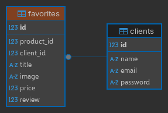

## Teste Tecnico Magazine Luiza Aiqfome

O teste consiste em construir um APIRestful com rotas clientes e favoritos

## Como instalar

1. Instale o [Docker](https://docs.docker.com/install/)
2. Instale o [Docker Compose](https://docs.docker.com/compose/install/linux/)
3. Clone o repositorio
4. Copie o arquivo .env.example para .env
5. Excute o comando `docker-compose up --build -d`
6. Fim

## Documentação da API

. Link da documentação da API online: [Link](https://www.postman.com/cryosat-candidate-18825323/workspace/teste-aiqfome-api/collection/33276918-0643cef2-6b48-41fc-a60b-ac6cb60f23ec?action=share&creator=33276918)

. Ou

. Apos subir o projeto acesse [`http://localhost:5000/docs`](http://localhost:5000/docs)

## Tecnologias Utilizadas

    . Python 3.12
    . FastAPI
    . SQLAlchemy
    . Psycopg
    . Alembic
    . Pytest

## Digrama do Banco de dados

. 
